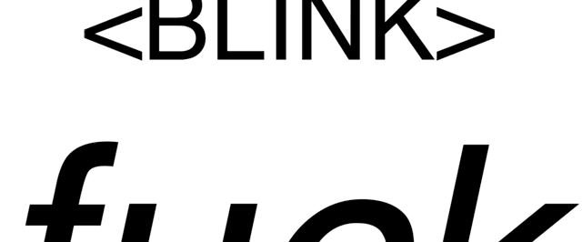

#  

# blinktag.css
I miss the &lt;blink&gt; tag. Don't you?

Documentation is dumb. Just go look at the [demo](http://www.happyacro.com/blinktag.html), or clone this repo and check out blinktag.html.

You're welcome.

# #humblebrag

Check out my cool Web 5.0 website hosted on a .com domain that has vowels, because that's how the internet works when you're clever enough to come up with an original domain rather than cop out with .io whatever.

[http://www.happyacro.com](http://www.happyacro.com)

# License

All scripts are licensed with the [Apache license](http://en.wikipedia.org/wiki/Apache_license), which is a great license because, essentially it:

* a) covers liability - my code should work, but I'm not liable if you do something stupid with it
* b) allows you to copy, fork, and use the code, even commercially
* c) is [non-viral](http://en.wikipedia.org/wiki/Viral_license), that is, your derivative code doesn't *have to be* open source to use it

Other great licensing options for your own code: [BSD License](https://en.wikipedia.org/wiki/BSD_licenses), [MIT License](https://en.wikipedia.org/wiki/MIT_License), or [Creative Commons](https://en.wikipedia.org/wiki/Creative_Commons_license).

Here's the license:

Copyright (c) 2017, Coder Cowboy, LLC. All rights reserved.

Redistribution and use in source and binary forms, with or without
modification, are permitted provided that the following conditions are met:
* 1. Redistributions of source code must retain the above copyright notice, this
list of conditions and the following disclaimer.
* 2. Redistributions in binary form must reproduce the above copyright notice,
this list of conditions and the following disclaimer in the documentation
and/or other materials provided with the distribution.
  
THIS SOFTWARE IS PROVIDED BY THE COPYRIGHT HOLDERS AND CONTRIBUTORS "AS IS" AND
ANY EXPRESS OR IMPLIED WARRANTIES, INCLUDING, BUT NOT LIMITED TO, THE IMPLIED
WARRANTIES OF MERCHANTABILITY AND FITNESS FOR A PARTICULAR PURPOSE ARE
DISCLAIMED. IN NO EVENT SHALL THE COPYRIGHT OWNER OR CONTRIBUTORS BE LIABLE FOR
ANY DIRECT, INDIRECT, INCIDENTAL, SPECIAL, EXEMPLARY, OR CONSEQUENTIAL DAMAGES
(INCLUDING, BUT NOT LIMITED TO, PROCUREMENT OF SUBSTITUTE GOODS OR SERVICES;
LOSS OF USE, DATA, OR PROFITS; OR BUSINESS INTERRUPTION) HOWEVER CAUSED AND
ON ANY THEORY OF LIABILITY, WHETHER IN CONTRACT, STRICT LIABILITY, OR TORT
(INCLUDING NEGLIGENCE OR OTHERWISE) ARISING IN ANY WAY OUT OF THE USE OF THIS
SOFTWARE, EVEN IF ADVISED OF THE POSSIBILITY OF SUCH DAMAGE.
  
The views and conclusions contained in the software and documentation are those
of the authors and should not be interpreted as representing official policies,
either expressed or implied.
